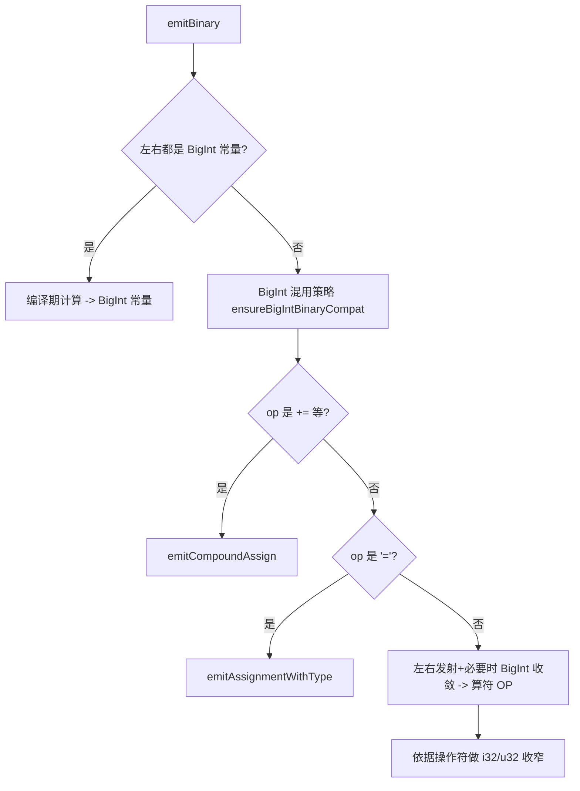
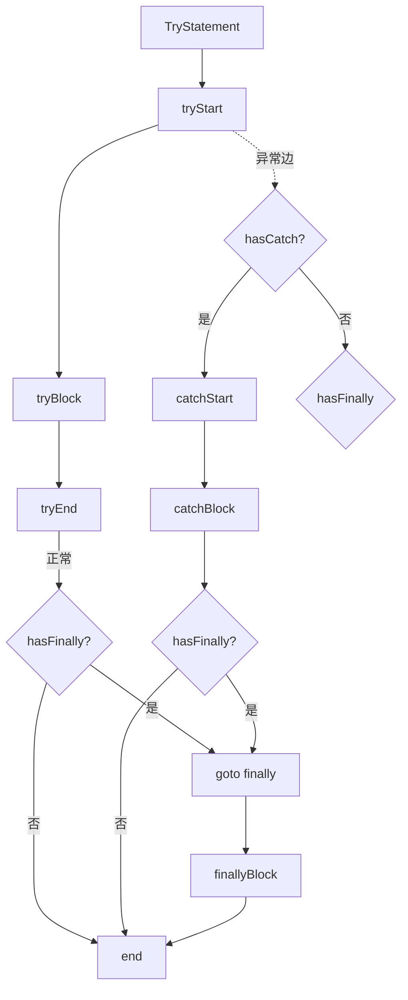
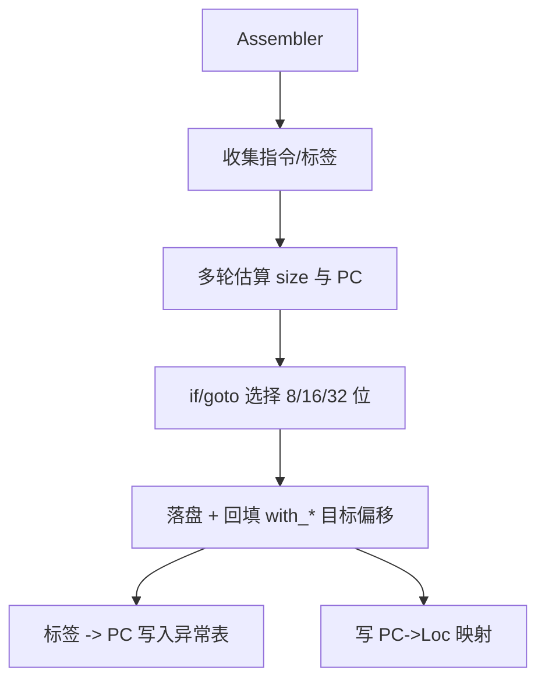
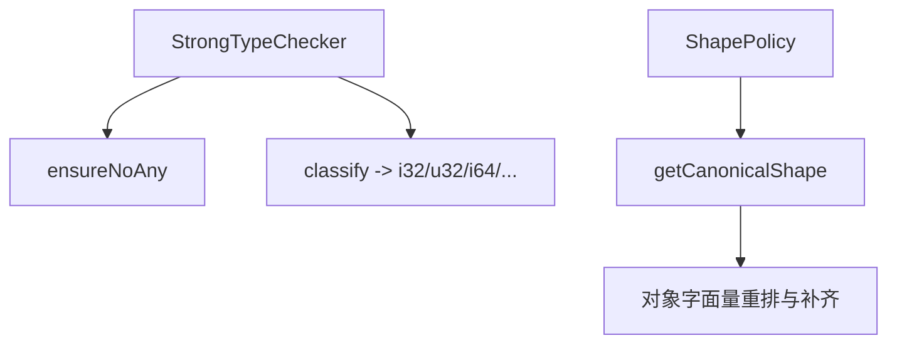

# QuickJS TypeScript Compiler - 流程图（Mermaid）

本文档基于仓库当前实现（src/compile.ts、assemble.ts、optimize.ts、bytecode.ts、types.ts、shape.ts、env.ts、ir.ts）整理了关键流程的 Mermaid 图，便于整体理解与评审。

> 提示：在 Markdown 预览或任意支持 Mermaid 的查看器中查看。

---

## 1. 顶层流水线

```mermaid
digraph
  compileSource -> emitStmt[遍历 SourceFile.statements]
  compileSource -> assemble[Assembler.assemble]
  assemble -> optimize[optimizeBytecode]
  optimize -> write[writeFunctionOrModule]
```
```

## 2. 表达式分派 emitExpr

```mermaid
flowchart TD
  A[emitExpr(expr)] -->|Await| A1[emitAwait]
  A -->|Yield| A2[emitYield]
  A -->|BigIntLiteral| A3[BigInt 构造]
  A -->|Numeric| A4[push_i32/push_const]
  A -->|String/Bool/Null| A5[push_*]
  A -->|Identifier| A6[emitIdentLoad]
  A -->|Paren| A7[emitExpr(inner)]
  A -->|As/Assert| A8[按目标类型收窄]
  A -->|Binary| A9[emitBinary]
  A -->|Call| A10[emitCall/动态import/eval]
  A -->|PropAccess| A11[get_field]
  A -->|ElemAccess| A12[get_array_el]
  A -->|ObjectLit| A13[emitObjectLiteralWithShape]
  A -->|ArrayLit| A14[array_from]
  A -->|Default| A15[undefined]
```

## 3. 二元运算与赋值



## 4. 调用

```mermaid
flowchart TD
  C[emitCall] --> C1{callee 是 obj.prop?}
  C1 -- 是 --> C2[obj; get_field2]
  C1 -- 否 --> C3[emit callee]
  C2 --> C4[逐参数发射并按签名收窄]
  C3 --> C4
  C4 --> C5{method?}
  C5 -- 是 --> C6[call_method(argc)]
  C5 -- 否 --> C7[call(argc)]
```

## 5. 语句分派 emitStmt（节选）

```mermaid
flowchart TD
  S[emitStmt] --> S1[Empty/Debugger/Throw]
  S --> S2[Labeled{loop/switch/other}]
  S --> S3[Break/Continue{含 label 查找}]
  S --> S4[Do/While/For]
  S --> S5[Switch]
  S --> S6[ForIn{严格/非严格}]
  S --> S7[ForOf{IteratorClose}]
  S --> S8[With{静态/动态}]
  S --> S9[Var 声明/解构/导出]
  S --> S10[Import/Export]
  S --> S11[Class/Function 声明]
  S --> S12[Expr/Return/If/Try]
```

### 5.1 ForIn（严格路径）

```mermaid
flowchart TD
  FI[emitForIn(strict)] --> K1[obj->cur]
  K1 --> K2[seen={} keys=[]]
  K2 --> L{cur!=null?}
  L -- 否 --> M[i=0]
  L -- 是 --> N[names = O.getOwnPropertyNames(cur)]
  N --> O[i=0]
  O --> P{i<names.length?}
  P -- 否 --> Q[cur=O.getPrototypeOf(cur)] --> L
  P -- 是 --> R[k=names[i]]
  R --> E1[if enumerable?]
  E1 -->|否| O
  E1 -->|是| E2{seen[k]?}
  E2 -- 是 --> O
  E2 -- 否 --> E3[seen[k]=1; keys.push(k)] --> O
  M --> T{i<keys.length?}
  T -- 否 --> U[end]
  T -- 是 --> V[k=keys[i] -> 绑定目标 -> 循环体] --> M
```

### 5.2 ForOf（带 IteratorClose）

```mermaid
flowchart TD
  FO[emitForOf] --> I1[iter = obj[Symbol.iterator]()] --> I2[done=true]
  I2 --> TRY[try]
  TRY --> L1[step = iter.next()]
  L1 --> D{step.done?}
  D -- 是 --> I3[done=true -> finally]
  D -- 否 --> I4[done=false; v=step.value 绑定目标]
  I4 --> BODY[循环体]
  BODY --> CONT[continue -> 回到 L1]
  TRY --> FINALLY
  FINALLY --> Z{iteratorCloseForOf 且 !done?}
  Z -- 否 --> END
  Z -- 是 --> RET[ret=iter.return; 非空则 ret.call(iter)] --> END
```

### 5.3 Try/Catch/Finally 与异常表



## 6. 汇编（短跳与异常表）



## 7. 优化器

```mermaid
flowchart TD
  O0[optimizeBytecode] --> O1[constFold(i32)]
  O1 --> O2[cleanDupSwapDrop]
  O2 --> O3[deadCodeElim]
  O3 --> O4[hotICRewrite(loop back-edges)]
  O4 --> O5[preciseMaxStackWithExceptions]
```

## 8. 写出字节码

```mermaid
flowchart TD
  W0[BytecodeWriter.writeTop] --> W1[Header(kind/flags/...)]
  W1 --> W2[Bytecode]
  W2 --> W3[Const Pool]
  W3 --> W4[Closures(扩展 flags)]
  W4 --> W5[VarRefs]
  W5 --> W6[Exceptions]
  W6 --> W7[pc2line(压缩)]
  W7 --> W8[Names(param/local)]
  W8 --> W9[Debug IDs(fn/file)]
  W9 --> W10[可选源码 Embed]
  W10 --> W11[Module imports/exports]
```

## 9. 类型与形状


