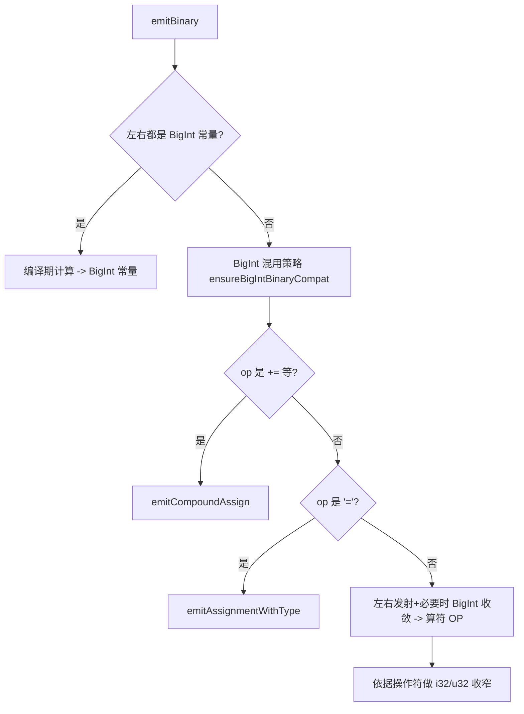

# 3. 二元与赋值（Mermaid）

```mermaid
flowchart TD
  B[emitBinary] --> B0{左右都是 BigInt 常量?}
  B0 -- 是 --> B1[编译期计算 -> BigInt 常量]
  B0 -- 否 --> B2[BigInt 混用策略 ensureBigIntBinaryCompat]
  B2 --> B3{op 是 += 等?}
  B3 -- 是 --> B4[emitCompoundAssign]
  B3 -- 否 --> B5{op 是 '='?}
  B5 -- 是 --> B6[emitAssignmentWithType]
  B5 -- 否 --> B7[左右发射+必要时 BigInt 收敛 -> 算符 OP]
  B7 --> B8[依据操作符做 i32/u32 收窄]
```
