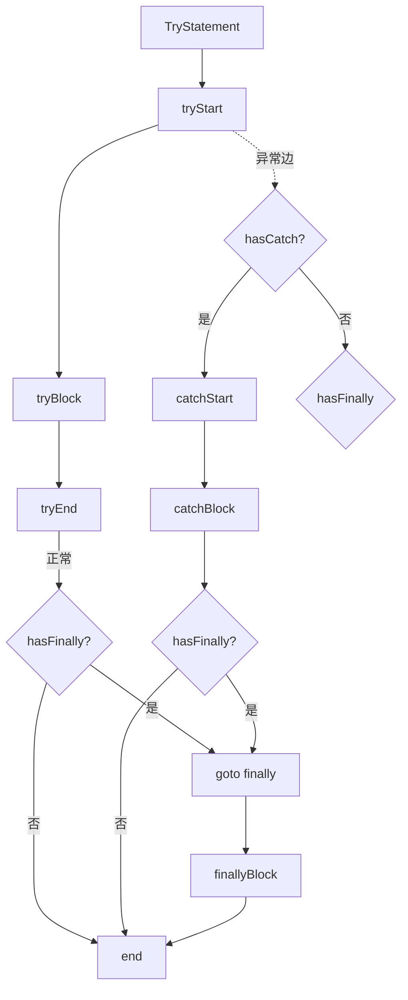

# 5.3 Try/Catch/Finally 与异常表

```mermaid
flowchart TD
  TCF[TryStatement] --> TS[tryStart]
  TS --> TB[tryBlock]
  TB --> TE[tryEnd]
  TE -->|正常| F{hasFinally?}
  F -- 是 --> J[goto finally]
  F -- 否 --> E[end]
  TS -. 异常边 .-> C{hasCatch?}
  C -- 是 --> CS[catchStart]
  C -- 否 --> F2{hasFinally}
  CS --> CB[catchBlock]
  CB --> F3{hasFinally?}
  F3 -- 是 --> J
  F3 -- 否 --> E
  J --> FB[finallyBlock] --> E
```
