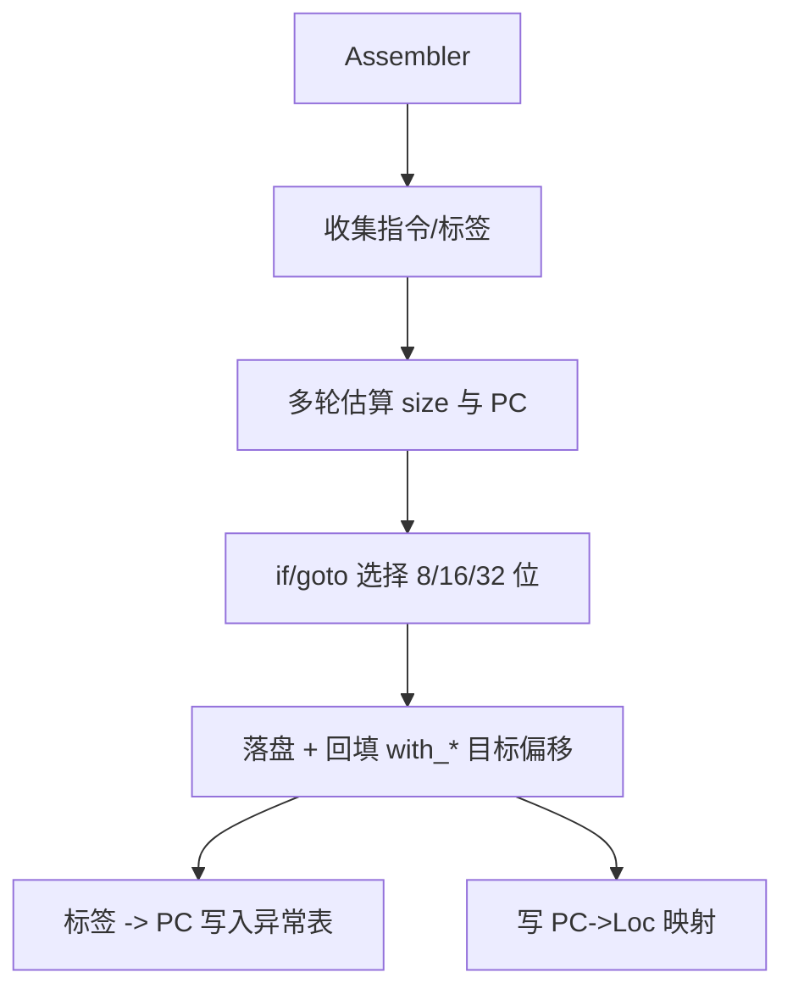

# 6. 汇编（短跳与异常表）

```mermaid
flowchart TD
  A0[Assembler] --> A1[收集指令/标签]
  A1 --> A2[多轮估算 size 与 PC]
  A2 --> A3[if/goto 选择 8/16/32 位]
  A3 --> A4[落盘 + 回填 with_* 目标偏移]
  A4 --> A5[标签 -> PC 写入异常表]
  A4 --> A6[写 PC->Loc 映射]
```
